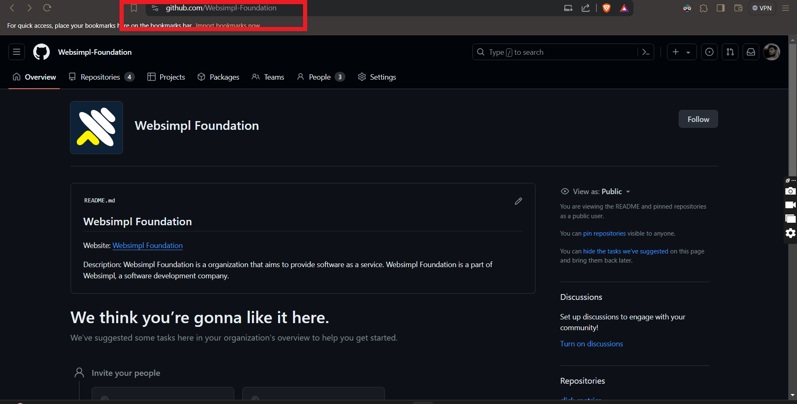
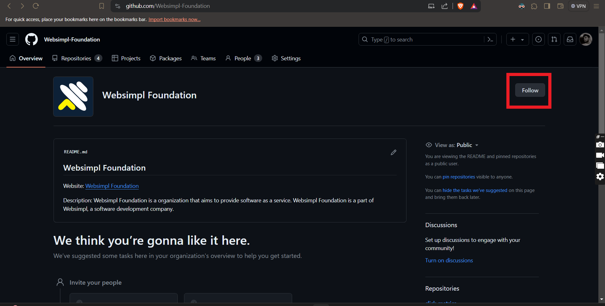
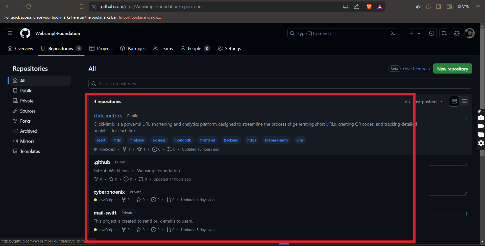
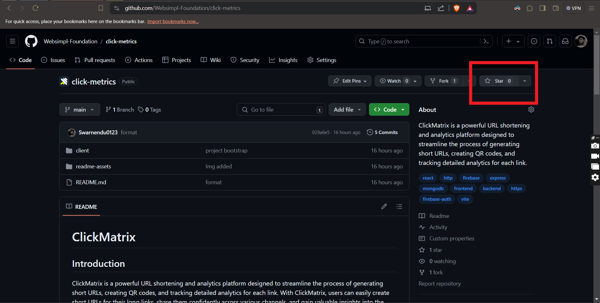
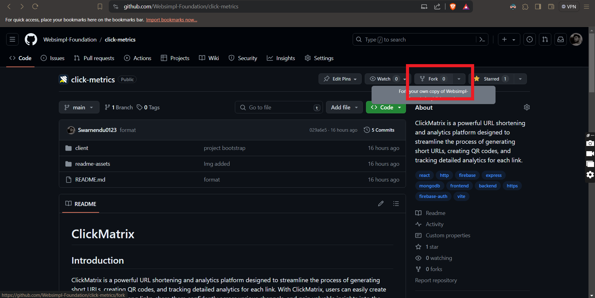
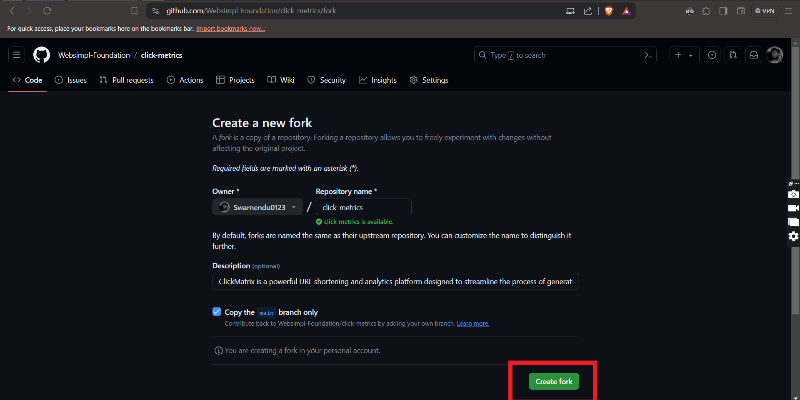

# WebSimpl Foundation
We value the participation of each member of the Websimpl community and want all participants to have an enjoyable and fulfilling experience. Accordingly, all participants are expected to show respect and courtesy to other participants throughout their interactions. We value each contributor's time and effort, and we strive to provide a collaborative, collegial, and respectful environment for everyone.

## How to contribute
We welcome contributions from everyone. Here are a few ways you can help:

1. Go to the github organization page of [Websimpl Foundation](https://github.com/Websimpl-Foundation)
   
2. Foollow the organization
   
3. Choose the repository you want to contribute to
   
4. Give a star to the repository
   
5. Fork the repository
    
6. The repository will be forked to your account
    

You are ready to contribute to the repository. Make changes and create a pull request. We will review your changes and merge them if they are good to go.